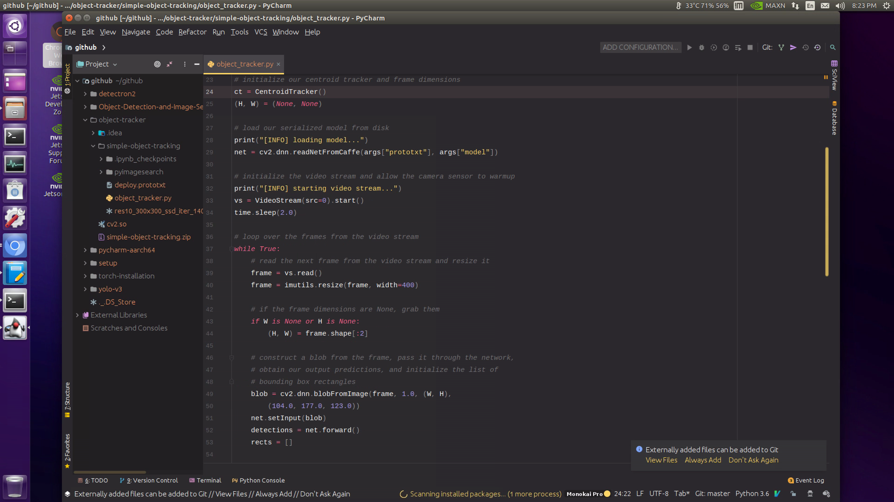

# PyCharm-aarch64

## Demo

## Intro

PyCharm is an integrated development environment (IDE) used in computer programming, specifically for the Python language. It is developed by the Czech company JetBrains. \
 \
 Check out more info [here](https://www.jetbrains.com/pycharm/)

## Setup

### Install with the provided shell script
$ git clone https://github.com/yqlbu/pycharm-aarch64/ \
$ cd pycharm-aarch64 \
$ sudo chmod +x install.sh && ./install.sh

### Install manually

#### 1. Install the dependency package:

$ cd ~/Downloads \
$ sudo apt-get update && sudo apt-get install openjdk-8-jdk

#### 2. Downloaded the Linux version of PyCharm community from their website, extracted the files

https://www.jetbrains.com/pycharm/download/#section=linux \
 \
$ tar -xzf pycharm-professional-2019.3.4.tar.gz && cd pycharm-2019.3.4/bin \
$ mv pycharm.sh pycharm && sudo chmod +x pycharm

#### 3. xport the path to root and test

$ echo 'export PATH=/home/'$USER'/pycharm-2019.3.4/bin:$PATH' >> .bashrc
 
### How to use

Go to your home directory and type "pycharm" \
 \
Enjoy!

### To customize themes, you may check out the following link:

https://blog.csdn.net/u012750106/article/details/86577792
